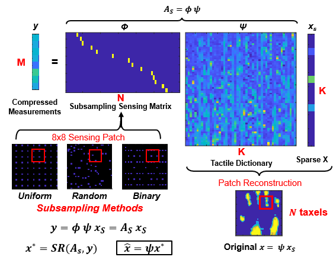

<div align="center">

# Compressive Subsampling Improves Spatiotemporal Resolution of Tactile Skin through Embedded Software

[[Paper]()]

[Dian Li (李典)]()<sup>1</sup>, 
[Ariel Slapyan](https://scholar.google.com/citations?hl=en&user=8uVwi4UAAAAJ&view_op=list_works&sortby=pubdate)<sup>2</sup>, 
[Nitish Thakor](https://scholar.google.com/citations?user=SB_7Bi0AAAAJ&hl=en)<sup>1,2,3</sup>
<br />
<sup>1</sup> Department of Biomedical Engineering, Johns Hopkins School of Medicine, Baltimore, USA<br />
<sup>2</sup> Department of Electrical and Computer Engineering, Johns Hopkins University, Baltimore, USA<br />
<sup>3</sup> Department of Neurology, Johns Hopkins School of Medicine, Baltimore, USA

</div>

> High-speed tactile arrays are crucial for real-time robotic control and reflex in unstructured environments. However, increased pixel counts lead to scanning latency, with large tactile arrays rarely exceeding 100 Hz readout rates. To address this, we develop an adaptive compressive tactile subsampling method that leverages patterns in tactile data to measure a few optimized projections of the tactile sensing matrix and classify or reconstruct the tactile interaction using an efficient sparse recovery algorithm and a learned overcomplete tactile dictionary. Testing on a 32x32 tactile sensor array, we evaluated reconstruction error and classification accuracy with 30 daily objects during high-speed interactions. Compressive tactile subsampling increased frame rates by 18X compared to the traditional raster scan method, maintaining accuracy with minimal error. These improvements enable tactile systems to detect objects within 20ms of contact with 88% accuracy and track high-velocity projectiles that raster scan completely misses. Our software-only method enhances standard arrays without hardware changes, allowing us to rapidly apply our technique to new tactile arrays that can be low-cost and robust – as we demonstrate for foam-bullet detection and plantar pressure profiling. The scalability of the approach holds promise for covering large areas of robots and surfaces with tactile skin. Compressive tactile subsampling can be immediately implemented in nearly any tactile sensor array to boost spatiotemporal resolution and enable new abilities.


<div align="center">
    
</div>

---
## Principles
**Down-sampling Mode**
:
In this sampling mode, the sensor measures the force with the pixels with designated numbers, which are distributed evenly in the space. The position of measured pixels will shift with time to cover all the space of the sensor. <br />

**Random Sampling Mode**
:
In random sampling, the sensor measures the force with the pixels with random positions. <br />

**Binary Subsampling Mode**
:
The binary sampling mode will define a logarithmic order of positions of measured pixels in the 2D sensor. If one of the pixels measures force larger than a threshold, the sensor will measure its surrounding pixels. This adaptive process will continue recursively until the force of all surrounding pixels is lower than the threshold. During this process, there is no repetitive measured pixel for each tactile frame. <br />

**Orthogonal Matching Pursuit (OMP)**
:
OMP is a greedy algorithm used for sparse signal representation or sparse approximation[^OMP]. It is widely used in applications like compressed sensing, sparse coding, and dictionary learning. OMP attempts to find the best sparse representation of a signal as a linear combination of a small number of atoms (columns) from a dictionary matrix.

**Learned Dictionary Learning and its Recovery**
:
The learned dictionary is trained by the patches randomly selected from the collected full raster tactile images using the K-SVD method. The patches are of smaller size (e.g. 8x8 or 16x8) than the full 32x32 tactile images. Then, for each patch of subsampled tactile image, the ``FastOMP`` method with the learned dictionary and its corresponding sensing matrix rapidly encodes its sparse vector[^FastOMP]. After multiplying the sparse vector with the learned dictionary, we obtained the approximate full-raster patches of images. Last, we average the force values from the portions of overlapped patches[^ksvd]. <br />

**Linear Interpolation Recovery**
:
Recovery using linear interpolation is a reconstruction of a function f ∈ **ℝ**<sup>2x1</sup> (e.g. a natural or tactile image) according to the values of some scattered points distributed in the 2D plane by using the linear method. To realize this task, we use a MATLAB function - ``scatteredInterpolant`` with ``'linear'`` as its ``Method`` and ``ExtrapolationMethod``. <br />

**Sparse Representation-based Classification (SRC)**
:
In SRC, we first build a library, which is a matrix with flattened full-raster images as its columns. Each column of the library has a known class or label. Then, for a subsampled tactile image, the ``FastOMP`` method with the library and its corresponding sensing matrix rapidly encodes its sparse vector. After that, we compute the L2 reconstruction error using the coefficients of the sparse vector corresponding to each of the classes separately. The class that minimizes the L2 reconstruction error is selected to be the one for the tested tactile image[^SRC].

<div align="center">
    
</div>

## Usage
The codes for using our methods for tactile image data and realizing our results are explained below. Notice that the user is required to contact the authors to get permission to access our data files. Some helper functions are not described here, but you can check the comments about their usage in the corresponding files.

### Subsampled Data Acquisition
If you want to collect some tactile data in a subsampling manner, use the folder `Subsampling_Code\Subsampling_Basics\`. To sample tactile data, the user first needs to upload `Subsampling.ino` to the sensor after adjusting the parameters. After that, run `SubsamplingControl.m` with desirable parameters to sample data using various methods.
* `SubsamplingControl.m` is the main function for subsampling in three different modes: regular, random and binary.
* `SubsamplingDisplay.m` is used to visualize the subsampled tactile image.
* `downSamplingShift.m`, `randomSampling.m` and `binarySampling.m` are functions for regular, random and binary sampling methods, respectively.
* `Subsampling` contains the Arduino code used to enable the sensor to execute subsampling tactile data within a designated duration.

### Training Data Collection
If you want to obtain training data, use the folder `Subsampling_Code\dict_training\`. The user can directly run the section in `trainData.m` according to the training image they need. The user can also run the last section to visualize the full raster training image they collected.
* `trainData.m` is responsible for collecting the training data and it also enables you to see the tactile image you collected.

### Tactile Dictionary Training
The folder `Subsampling_Code\dict_training\` is also for the task of training dictionary, it allows to train three types of dictionary: learned dictionary, DCT dictionary and Haar dictionary (square and overcomplete). The user can acquire all types of dictionaries by running the following MATLAB files. If the user want to recover subsampled images as a whole, then they can run `dictCombine.m` to get the assembled dictionaries for the whole subsampled images.
* `dictTraining_ksvd.m` is for training the learned dictionary based on your training data.
* `dictTraining_DCT.m` is used to train the DCT dictionary.
* `dictTraining_Haar.m` is used to train the square Haar dictionary (i.e. the number of patch measurements equals to the dictionary size).
* `dictTraining_overcompleteHaar.m` is used to train the Haar dictionary with the desired dictionary size.
* `dictCombine.m` combines several patch dictionaries together to recover subsampled tactile images as a whole.

### Subsampled Image Recovery
The folder `Subsampling_Code\reconstruction` is for the reconstruction of collected subsampled tactile data. First, the user can recover the subsampled data using various methods (dictionaries or interpolation) by running the following MATLAB files. Then, they can check the reconstructed images using the file `recDataDisplay.m`. Last, they can run `reconAccPlot.m` to calculate the accuracies of the reconstructed images and plot some relevant figures shown in the paper.
* `dictRecovery1.m` is used to reconstruct the tactile image patch by patch by using various types of dictionaries.
* `dictRecovery2.m` is used to reconstruct the tactile image as a whole by using various types of dictionaries.
* `interpRecovery1.m` is used to reconstruct the tactile image by using linear interpolation.
* `recDataDisplay.m` is used to view the reconstructed subsampled image.
* `reconAccPlot.m` is used to calculate the accuracies of the reconstructed images and plot some relevant figures. Here, the objects used to do the subsampling have also been used to train the learned dictionary for subsampled image recovery.

### Subsampled Image Classification
The folder `Subsampling_Code\classification` is for the classification of collected subsampled tactile data. Firstly, the user can run `libTraining.m` to acquire the library for SRC. Then, they can run each section of `SRC.m` to conduct SRC, calculate accuracies or realize some figures in the paper. Besides, the code for the visualization of the library is also provided. Here, the objects used for subsampling have also been used to form the library for subsampled image classification.
* `libTraining.m` is used to construct a library for SRC.
* `libVis.m` visualizes the library.
* `SRC.m` is used to determine the classes the reconstructed images belong to, calculate the accuracies of the classification of different sampling modes and measurement levels, as well as plot some relevant figures.

## Applications
With the proposed sampling modes, reconstruction using a learned dictionary, and SRC, we have designed and conducted several experiments to investigate their feasibility and accuracy. Here, we explain the folders for these experiments.

### Generalizability
The folder `Subsampling_Code\reconstruction` is also for the application of reconstruction of collected subsampled tactile data from objects that are not used to train a learned dictionary. Firstly, users need to collect some subsampled tactile images of their daily objects (e.g. keys or toothbrushes) by using the file `SubsamplingControl.m` explained above. Then, with the trained dictionary, they can recover the subsampled images using the above file `dictRecovery1.m`. Last, they can run `genReconAccPlot.m` to calculate the accuracies of the reconstructed images and plot some relevant figures shown in the paper. To prove the generalizability of our methods, the objects used to do the subsampling have NOT been used to train the learned dictionary for subsampled image recovery.
* The file `genReconAccPlot.m` calculates the accuracies of the reconstructed images and plots some relevant figures.

### Projectile
The folder `Subsampling_Code\projectile` is for the application of fast detection of a tennis ball (as a projectile) onto the sensor. Firstly, users can directly use our data with permission, or they need to collect the tactile images of the bouncing tennis ball by using the file `SubsamplingControl.m` with the binary subsampling mode. Then, they need to run each section of `projectileAnalysis.m` to process the projectile's subsampled data and plot the figures shown in the paper.
* The file `projectileAnalysis.m` analyzes the projectile's subsampled data and generates some figures.

### Deformation
The folder `Subsampling_Code\deform` is for the application of roughly drawing the shape of deformable objects. Firstly, users can directly use our data with permission, or they need to collect the tactile images of some deformable objects (e.g. deflated balloon or elastic objects) by using the file `SubsamplingControl.m` with the binary subsampling mode. Then, they need to run each section of `deformAnalysis.m` to process the subsampled data of those deformable objects and draw their rough shape, as shown in the paper.
* The file `deformAnalysis` analyzes the subsampled data of deformable objects and generates a figure depicting their approximate shapes.

### Real-time Reconstruction and Classification
The folder `Subsampling_Code\realTime` is for the application of real-time reconstruction or classification without any data processing outside the sensor.<br />
To realize the real-time reconstruction, firstly, the user is expected to have a reasonable learned dictionary using the K-SVD method. After adjusting some parameters, the user needs to upload the `realTimeBinaryReconPBP.ino` to the sensor. Then, they run the `helperMat.m` and `dict2Arduino_recon.m` to transfer the dictionary and its helper matrices to the sensor. Finally, the user can visualize the real-time tactile images by using `realTimeVis.m`.<br />
For its simulation, the user needs to upload the file named `realTimeBinaryReconPBP.ino` and determine the accuracy by using the `realTimeSimu.m`, while all the remaining operations are the same as the real-time reconstruction.<br />
As for the real-time classification, first of all, the user is required to get the library through `libTraining.m` as mentioned above. After adjusting some parameters, the user needs to upload the `realTimeBinarySRC.ino` to the sensor. Then, they run the `dict2Arduino_class.m` to transfer the library to the sensor. Last, they can visualize the real-time classification through the serial monitor in the Arduino.

* `realTimeBinaryReconPBP` contains the Arduino code to enable the sensor to sample the tactile data in real time by using the binary subsampling method, and to reconstruct the subsampled image by a learned dictionary patch by patch.
* `realTimeBinaryReconPBPSimu` contains the Arduino code to enable the sensor to sample and reconstruct the full raster tactile data, which has been sampled and stored. This simulation aims to determine the accuracy of the real-time reconstruction method by a learned dictionary patch by patch.
* `realTimeBinarySRC` contains the Arduino code to enable the sensor to sample the tactile data in real time using the binary subsampling method, and to classify the subsampled tactile image using the SRC method.
* `dict2Arduino_recon.m` is used to transfer a learned dictionary and its corresponding helper matrices from MATLAB to the sensor.
* `dict2Arduino_class.m` is used to transfer a library used in the SRC from MATLAB to the sensor.
* `helperMat.m` is used to determine and store the helper matrices according to the learned dictionary which will be used in the real-time reconstruction later.
* `realTimeVis.m` is used to visualize the real-time reconstruction.
* `realTimeSimu.m` is used to determine the accuracy of reconstruction of full-raster tactile images in the simulation.
* `realTimePlot.m` is used to plot some relevant figures related to this application. 

### Rotator
The folder `Subsampling_Code\rotator` is for the application of fast detection of the pressure of a hard rotator on the sensor in varied frequencies. Firstly, users can directly use our data with permission, or they need to collect the tactile images of hard rotator by using the file `SubsamplingControl.m` with the binary subsampling mode. Then, they need to run each section of `rot.m` to process the subsampled data of the rotator and plot the single-sided amplitude spectrums shown in the paper.
* The file `rot.m` analyzes the subsampled data of the rotator at different speeds (or frequencies) and generates the single-sided amplitude spectrums.

## Citation
```
    @article{,
      author    = {Dian Li and Ariel Slapyan and Nitish Thakor},
      title     = {Compressive Subsampling Improves Spatiotemporal Resolution of Tactile Skin through Embedded Software},
      journal   = {arXiv preprint arXiv:},
      year      = {2024},
      url       = {}
    }
```

## Acknowledgement
We sincerely appreciate Becca Greene, Aidan Aug, Sriramana Sankar, and Trac Tran for their advice on this work.

## Contact
If you have any questions or inquiries, please feel free to contact this [email](mailto:aslepya1@jhu.edu).

## References
[^SRC]: Robust face recognition via sparse representation, 2009
[^FastOMP]: An Efficient FPGA Implementation of Orthogonal Matching Pursuit With Square-Root-Free QR Decomposition, 2018
[^KSVD]: K-SVD: An Algorithm for Designing Overcomplete Dictionaries for Sparse Representation, 2006
[^OMP]:  Matching pursuits with time-frequency dictionaries, 1993

